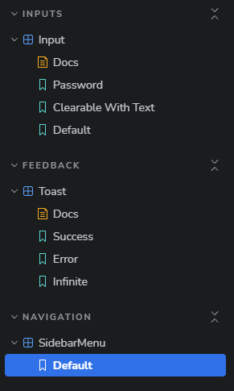
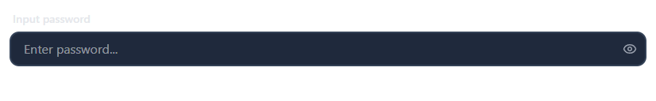
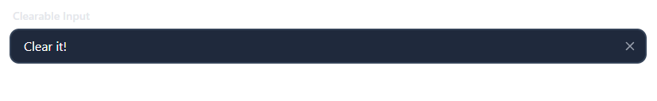
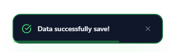
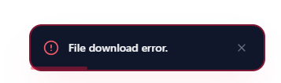
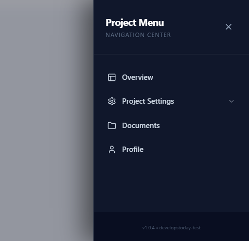
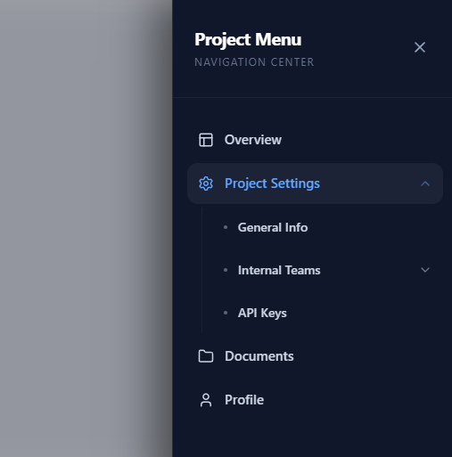

# React UI Component Library - Storybook Assessment

A professional, reusable UI component library built with **React**, **TypeScript**, **Tailwind CSS**, and **Framer Motion**. This project was developed as a technical assessment to demonstrate clean code practices, modular component architecture, and documentation using **Storybook**.

## 🚀 Features

- **Smart Input**: Multi-type support (text, password, number) with a password visibility toggle and a dynamic "clearable" functionality.
- **Toast Notifications**: Interactive notification system with auto-dismiss logic, different types (Success, Error, Info), and smooth Framer Motion transitions.
- **Recursive Sidebar Menu**: A high-end navigation component with infinite nesting support, smooth slide-in animations, and a backdrop blur overlay.

## 🛠 Tech Stack

- **Framework**: React 18 + Vite
- **Language**: TypeScript (Strict Mode)
- **Styling**: Tailwind CSS v4
- **Animations**: Framer Motion
- **Icons**: Lucide React
- **Documentation**: Storybook 8

## 📦 Installation & Setup

1. **Clone the repository:**
   ```bash
   git clone https://github.com/Kholod13/libraryReact.git
   cd libraryReact
   ```
2. **Install dependencies:**
   ```bash
   npm install
   ```
3. **Run Storybook:**
   ```bash
   npm run storybook
   ```
   Storybook will open automatically at http://localhost:6006

   
## 🧩 Component Overview
1. Input Component
   Extends standard HTML input attributes.
   Features an interactive "eye" icon for password fields.
   Includes a "clear" button that appears only when the field is not empty.
2. Toast Component
   Uses AnimatePresence for smooth exit animations.
   Implements useEffect with setTimeout for reliable auto-dismissal.
   Includes a visual progress bar (bonus feature).
3. Sidebar Menu
   Implements a recursive rendering pattern for multi-level nesting.
   Uses a "portal-like" fixed overlay with backdrop-blur.
   Fully responsive and closes on background click.


## 📸 Screenshots

1. **Storybook UI Overview**
   
   

2. **Input Component**

   
   

3. **Toast Component**

   
   

4. **Sidebar Menu**

   
   

**Task:**
https://develops.notion.site/Front-end-JS-engineer-test-assessment-the-React-component-library-21b0fe54b07b80aa9607c6fc88aa90e0?pvs=143
